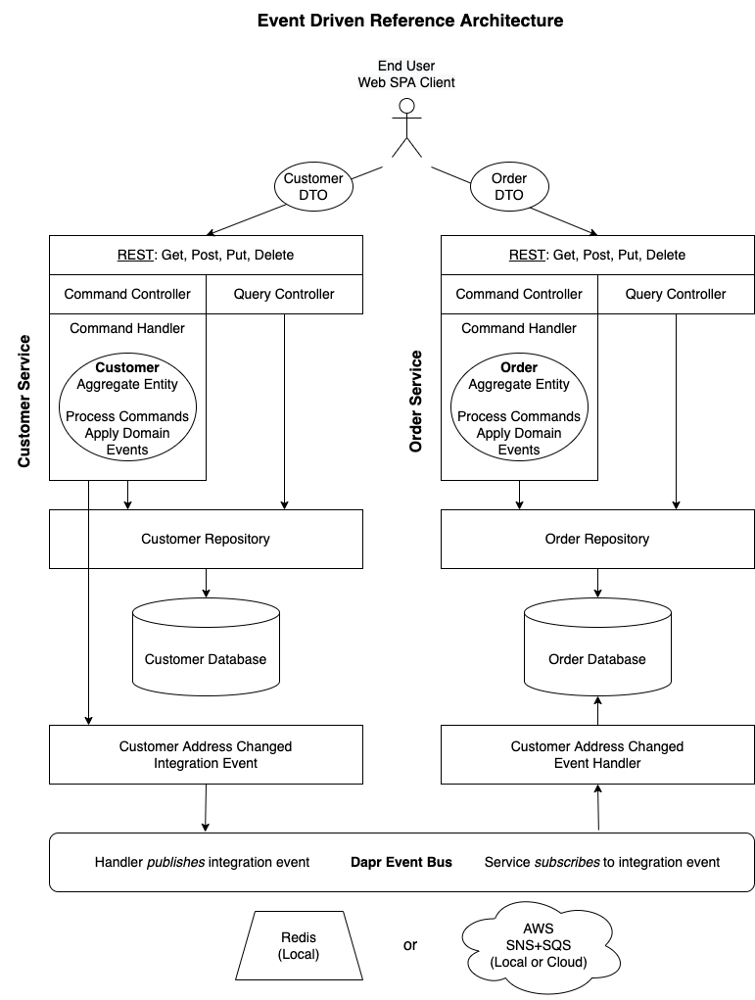

# EventDriven.CQRS

An event-driven approach to Command Query Responsibility Segregation.

## Prerequisites
- [.NET Core SDK](https://dotnet.microsoft.com/download) (5.0 or greater)
- [Docker Desktop](https://www.docker.com/products/docker-desktop)
- MongoDB Docker: `docker run --name mongo -d -p 27017:27017 -v /tmp/mongo/data:/data/db mongo`
- [MongoDB Client](https://robomongo.org/download):
  - Download Robo 3T only.
  - Add connection to localhost on port 27017.
- [Dapr](https://dapr.io/) (Distributed Application Runtime)
  - [Install Dapr CLI](https://docs.dapr.io/getting-started/install-dapr-cli/)
  - [Initialize Dapr](https://docs.dapr.io/getting-started/install-dapr-selfhost/)

## Packages
- [EventDriven.CQRS](https://www.nuget.org/packages/EventDriven.CQRS)

## Introduction

This project builds on the principles of [Domain Driven Design](https://en.wikipedia.org/wiki/Domain-driven_design) to provide a set of abstractions and reference architecture for implementing the [Command Query Responsibility Segregation](https://docs.microsoft.com/en-us/azure/architecture/patterns/cqrs) pattern, also known as as CQRS. Because entities process commands by emitting domain events, adding [event sourcing](https://microservices.io/patterns/data/event-sourcing.html) at a later time will be relatively straightforward.

The **EventDriven.CQRS.Abstractions** library contains interfaces and abstract base classes to support these concepts:
- **Entity**: A type that has an identity with behavior and state that can change over time.
- **Command**: An object that is sent to the domain for a state change which is handled by a command handler.
- **Event**: A statement of fact about what change has been made to the domain state.

The **Reference Architecture** projects demonstrate how to apply these concepts to two microservices: `CustomerService` and `OrderService`. In addition, each service has *separate controllers for read and write operations*, thus segregating command and query responsibilities, with different sets of models, or Data Transfer Objects (DTO's).
- **Query Controller**: Uses repository to retrieve entities and converts them to DTO's with AutoMapper.
- **Command Controller**: Converts DTO's to domain entities using AutoMapper. Then hands control over to a command handler for executing business logic.
- **Command Handler**: Uses a domain entity to process commands which generate one or more domain events, then requests entity to apply the domain events in order to mutate entity state. Persists entity state to a state store and optionally publishes an integration event which is handled by another microservice.
- **Repository**: Persists entity state to a database.
- **Event Bus**: Used to publish integration events, as well as subscribe to events using an event handler. Dapr is used to abstract away the underlying pub/sub implementation. The default is Redis (for local development), but Dapr can be configured to use other components, such as AWS SNS+SQS.

> **Note**: This example illustrates a *simple* CQRS implementation with a **shared database** and **single service** for both read and write operations. A more sophisticated implementation might entail **separate services and databases** for read and write operations, using integration events to communicate between them. This simple example only uses integration events to communicate between the customer and order services.

<p align="center">
  
</p>

### Usage: Reference Architecture Projects

1. Run Dapr Dashboard.
   - Then open http://localhost:8080 to view containers after executing `dapr run` commands.
    ```
    dapr dashboard
    ```
2. Use Dapr to run the customer service.
    ```
    dapr run --app-id customer-service --app-port 5000 --components-path ../dapr/components -- dotnet run
    ```
3. Use Dapr to run the order service.
    ```
    dapr run --app-id order-service --app-port 5150 --components-path ../dapr/components -- dotnet run
    ```
4. Create some customers.
   - Open http://localhost:5000/swagger
   - Execute posts using contents of **customers.json**.
   - Copy post response, modify fields, then execute puts.
     - Make sure to copy `etag` value from last response, or you will get a concurrency error.
   - Copy `id` and `etag` values to execute deletes.
   - Execute gets to retrieve customers.
   - View customers database collections using Robo 3T.
5. Create some orders.
   - Execute posts using contents of **orders.json**.
   - Copy post response, modify fields, then execute puts.
     - Make sure to copy `etag` value from last response, or you will get a concurrency error.
   - Copy `id` and `etag` values to execute deletes.
   - Execute gets to retrieve orders.
   - View orders database collections using Robo 3T.
6. Update the address of a customer who has order.
   - Note the address is also updated for the customer's orders.
   - Observe log messages in terminal when integration events are published and handled.
7. To **debug** services, you will need to use **Visual Studio Code** with the *Dapr extension*.
   - Open instances of VS Code at both CustomerService and OrderService.
   - If .vscode folder not present:
     - First create build and debug artifacts.
     - Then from the task palette run `Dapr: Scaffold Dapr Tasks`.
       - Enter values for launch, app id (customer-service) and port (5000).
       - Enter values for launch, app id (order-service) and port (5050).
   - Switch to the Debug tab and select "with Dapr" configuration.
   - Set breakpoints as needed and press F5 to start debugging.

### Usage: EventDriven.CQRS.Abstractions

> This section describes how to build the Customer and Order services from scratch using the **EventDriven.CQRS.Abstractions** package. For your own project substitute `Customer` and `Order` for your own aggregate entites and related classes.

1. Add **Domain** and **CustomerAggregate** folders to the project, then add a `Customer` class that extends `Entity`.
   - Add properties representing entity state.
   - Create commands that are C# records and extend a `Command` base class.
    ```csharp
    public record CreateCustomer(Customer Customer) : Command.Create(Customer.Id);
    ```
  - Create domain events that extend `DomainEvent`.
    ```csharp
    public record CustomerCreated(Customer Customer) : DomainEvent(Customer.Id);
    ```
   - Where you need to execute business logic, implement `ICommandProcessor` and `IEventApplier` interfaces to process commands by emitting domain events and to apply those events to mutate entity state.
        ```csharp
        public IEnumerable<IDomainEvent> Process(CreateCustomer command)
            // To process command, return one or more domain events
            => new List<IDomainEvent>
            {
                new CustomerCreated(command.Customer)
            };

        public void Apply(CustomerCreated domainEvent) =>
            // Set Id
            Id = domainEvent.EntityId != default(Guid) ? domainEvent.EntityId : Guid.NewGuid();
        ```
2. Add a `CustomerCommandHandler` class that implements `ICommandHandler` for create, update and remove commands.
   - Inject `ICustomerRepository`, `IEventBus` and `IMapper` into the ctor.
   - In the handler for `CreateCustomer`, write code to process the command, apply events, and persist the entity.
    ```csharp
    public async Task<CommandResult<Customer>> Handle(CreateCustomer command)
    {
        // Process command
        _logger.LogInformation("Handling command: {commandName}", nameof(CreateCustomer));
        var events = command.Customer.Process(command);
        
        // Apply events
        var domainEvent = events.OfType<CustomerCreated>().SingleOrDefault();
        if (domainEvent == null) return new CommandResult<Customer>(CommandOutcome.NotHandled);
        command.Customer.Apply(domainEvent);
        
        // Persist entity
        var entity = await _repository.Add(command.Customer);
        if (entity == null) return new CommandResult<Customer>(CommandOutcome.InvalidCommand);
        return new CommandResult<Customer>(CommandOutcome.Accepted, entity);
    }
    ```
   - Create a **Common** class library project and add the package **EventDriven.CQRS.Abstractions**.
     - Reference the Common project from the CustomerService project.
     - Create a `CustomerAddressUpdated` record that extends `IntegrationEvent`.
    ```csharp
    public record CustomerAddressUpdated(Guid CustomerId, Address ShippingAddress) : IntegrationEvent;
    ```
   - In the `UpdateCustomer` handler, see if the shipping address has changed, and if so, publish a `CustomerAddressUpdated` integration event, so that the order service can update the shipping address in the customer's orders.
    ```csharp
    public async Task<CommandResult<Customer>> Handle(UpdateCustomer command)
    {
        // Compare shipping addresses
        _logger.LogInformation("Handling command: {commandName}", nameof(UpdateCustomer));
        var existing = await _repository.Get(command.EntityId);
        var addressChanged = command.Customer.ShippingAddress != existing.ShippingAddress;
        
        try
        {
            // Persist entity
            var entity = await _repository.Update(command.Customer);
            if (entity == null) return new CommandResult<Customer>(CommandOutcome.NotFound);
            
            // Publish events
            if (addressChanged)
            {
                var shippingAddress = _mapper.Map<Integration.Models.Address>(entity.ShippingAddress);
                _logger.LogInformation("Publishing event: {eventName}", $"v1.{nameof(CustomerAddressUpdated)}");
                await _eventBus.PublishAsync(
                    new CustomerAddressUpdated(entity.Id, shippingAddress),
                    null, "v1");
            }
            return new CommandResult<Customer>(CommandOutcome.Accepted, entity);
        }
        catch (ConcurrencyException)
        {
            return new CommandResult<Customer>(CommandOutcome.Conflict);
        }
    }
    ```
3. Add a `CustomerCommandController` to the project that injects `CustomerCommandHandler` into the ctor.
   - Add Post, Put and Delete actions which accept a `Customer` DTO, map it to a `Customer` entity and invoke the appropriate command handler.
4. Add a `CustomerQueryController` to the project that injects a `ICustomerRepository` into the ctor.
   - Use the repository to retrieve entities, then map those to `Customer` DTO objects.
5. Repeat these steps for the Order service.
   - Reference the Common project.
   - Add **Integration/EventHandlers** folders with a `CustomerAddressUpdatedEventHandler` class that extends `IntegrationEventHandler<CustomerAddressUpdated>`.
   - Override `HandleAsync` to update the order addresses for the customer.
    ```csharp
    public override async Task HandleAsync(CustomerAddressUpdated @event)
    {
        _logger.LogInformation("Handling CustomerAddressUpdated event.");
        var orders = await _orderRepository.GetCustomerOrders(@event.CustomerId);
        foreach (var order in orders)
        {
            var shippingAddress = _mapper.Map<Address>(@event.ShippingAddress);
            await _orderRepository.UpdateOrderAddress(order.Id, shippingAddress);
        }
    }
    ```
   - In `Startup.ConfigureServices` register `CustomerAddressUpdatedEventHandler` then add the Dapr Event Bus.
    ```csharp
    services.AddSingleton<CustomerAddressUpdatedEventHandler>();
    services.AddDaprEventBus(Constants.DaprPubSubName);
    ```
   - In `Startup.Configure` use Cloud Events, map subscribe handlers, and map Dapr Event Bus endpoints, subscribing with the event handler.
    ```csharp
    // Use cloud events
    app.UseCloudEvents();
    app.UseEndpoints(endpoints =>
    {
        endpoints.MapControllers();
        
        // Map subscribe handlers
        endpoints.MapSubscribeHandler();
        endpoints.MapDaprEventBus(eventBus =>
        {
            // Subscribe with event handler
            eventBus.Subscribe(customerAddressUpdatedEventHandler, null, "v1");
        });
    });
    ```
